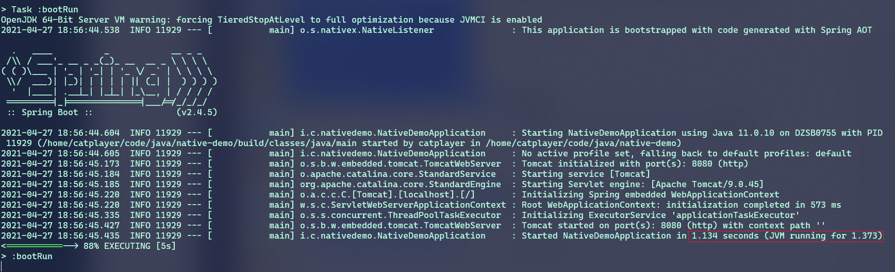
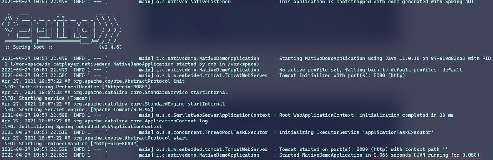

# Java AOT的应用

## Java为啥相比于c/c++会慢
Java为了实现一次编写，处处运行的特性，采用了虚拟机的技术，通过jvm来运行java的字节码来实现程序在不同平台的兼容性，为Java程序员屏蔽了平台的底层细节，来提高开发效率。
但是由于jvm运行Java字节码是运行时动态加载的，这样就会导致在程序执行的过程中需要jvm先解析java字节码，再将解析后的数据结构、方法、对象等运用到程序中，因此就会导致java的执行相较于c/c++这种没有运行时负载的语言执行速度相对较慢。

## Java的优化
由于Java程序运行速度的问题，导致很多追求低延迟，高性能的应用不得不选择c/c++来编写。为此java的虚拟机开发团队（sun）引入了JIT（just in time）的编译技术：jvm在运行java程序的方法时，可以根据该方法调用的频率，选择将该方法进一步编译成机器码，从而在后续调用该方法时则直接调用编译好的机器码指令，从而保证了更好的执行性能。

## AOT的目的
通过引入AOT，Java程序执行的速度得到了显著的改进，但是仍然存在着不足，JIT技术是通过程序运行时实时分析java方法的执行频率来进行优化的，很明显这种方式的优化是要在程序的运行时。但是对于大型的项目，java在启动时需要加载大量的字节码到内存中，此时程序尚未真正的运行，这个时候jit则没法派上用场。因此，java程序启动耗时长，并且大量加载字节码也导致需要占用较多的内存。像我们游戏的大厅接口启动时长（tomcat服务完成加载）大部分在30秒以上。

为了优化java程序的启动问题，java虚拟机团队又引入了一种新的编译技术：AOT（ahead of time），这里的time指的就是runtime，ahead of time表示的就是在程序执行之前，而这正是AOT技术的核心功能，在程序构建时进行优化，提高java程序启动的速度以及内存的消耗。

## AOT做了啥
AOT通过将java程序编译为本地的可执行文件（native image），可以保证在不依赖于jvm的情况下可以正常运行。因此在运行时不再需要加载字节码，因此极大程度的提高了程序的启动速度以及内存的占用。

AOT在编译java程序时，会将相关的第三方依赖，jdk依赖以及目标可执行文件需要的静态库等进行打包到可执行文件中，因此目标可执行文件具备了程序运行所有必要的依赖以及库。

## AOT的效果
这里主要是展示一个spring boot构建的web服务

### 传统JVM方式


加载时长需要1.1s左右

### native image


而通过native image构建的服务启动速度则缩短到0.056s

## AOT的使用

### Example.java
``` java
public class Example {

    public static void main(String[] args) { 
        String str = "Native Image is awesome"; 
        String reversed = reverseString(str); 
        System.out.println("The reversed string is: " + reversed); 
    } 
 
    public static String reverseString(String str) { 
        if (str.isEmpty()) 
            return str; 
        return reverseString(str.substring(1)) + str.charAt(0); 
    } 
}
```

### 步骤
1. 先安装GraalVM([Installation on Linux (graalvm.org)](https://www.graalvm.org/latest/docs/getting-started/linux/))
2. 编译源码，编译后生成Example.class的字节码

   `javac Example.java`

3. aop编译，编译后得到可执行文件：example

   **native-image Example**

4. 运行 `./example`

最终输出目标结果：


## 总结
运行过程慢通过JIT优化，启动过程慢就用AOT优化

## 参考
- [Native Image (graalvm.org)](https://www.graalvm.org/latest/reference-manual/native-image/)
- [Static Compilation of Java Applications at Alibaba at Scale | by Alina Yurenko | graalvm | Medium](https://medium.com/graalvm/static-compilation-of-java-applications-at-alibaba-at-scale-2944163c92e)
- [Announcing Spring Native Beta!](https://spring.io/blog/2021/03/11/announcing-spring-native-beta)
