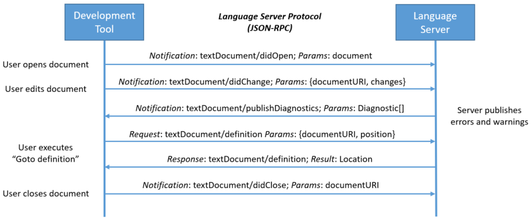

# LSP
LSP: 语言服务器协议（Language Sever Protocol），是微软开源发布的一套语言服务器规范。该协议的目的是方便开发工具或代码编辑器可以更好的提供编程语言的集成能力。如自动补全、定义跳转、查找引用等。

## 为什么要有LSP

传统的ide或者editor为了支持某种编程语言的开发，通常都需要开发商或者第三方为该平台专门编写代码来支持，常见的做法是编写插件。这种做法通常会导致，相同的语言插件，需要为每个平台单独提供。因此，维护成本比较高，而且受限于各个平台。

因此，微软推出了LSP，LSP是一套语言服务器与ide/editor的交互协议。这样为多个平台提供相同语言的集成功能的话，只需要实现一套语言服务器以及相应平台支持LSP，这样就可以实现该语言的集成。

## LSP架构

大体上LSP主要包含了两端：语言服务器（server）和 开发工具（client）
- 语言服务器：提供语言的集成功能，如代码高亮、语法错误提示、跳转定义等
- 开发工具：通过和语言服务器交互，将用户执行的操作发送给语言服务器，语言服务器进行解析，处理。并将执行结果返回。开发工具再将语言服务器返回的信息可视化展示在编辑器中，如语法错误时的标红，定义跳转时的跳转行为等。



## 语言服务器

由于语言服务器本身是一个独立的服务，同时其与客户端的交互是通过网络协议。因此其实现可以使用任何语言。只要遵守LSP即可。这样就给予了开发者极大的灵活度。比如由腾讯开源的 Lua LSP 就是使用Go语言实现的。同时对于一些开发者来说，如果有可用的LSP实现的话，可以只需要编写客户端即可实现语言集成。

需要注意的是，我们在编辑器中编辑源码文件时，并不是由编辑器直接保存的，实际上源码文件的修改是交给语言服务器完成的，编辑器主要的作用是将行为上报以及展示结果。而这也是当前一些流行的网页编辑器的实现方式，源码文件和语言服务器是部署在远程服务器中，网页编辑器通过和远程语言服务器进行交互来实现在线编辑代码的目的。

## 交互

### 协议

服务器与客户端交互的数据格式使用了 `JSON-RPC` ，一种基于JSON格式的远程调用协议。其优点就是简单易读。
``` json
//request: 定义跳转
{
    "jsonrpc": "2.0",//JSON-RPC 版本
    "id" : 1,
    "method": "textDocument/definition",//执行的操作
    "params": {
        "textDocument": {
            "uri": "file:///p%3A/mseng/VSCode/Playgrounds/cpp/use.cpp"//源码文件的uri
        },
        "position": {
            "line": 3,
            "character": 12
        }
    }
}

//response: 需要跳转的定义所在的位置
{
    "jsonrpc": "2.0",
    "id": 1,
    "result": {
        "uri": "file:///p%3A/mseng/VSCode/Playgrounds/cpp/provide.cpp",
        "range": {
            "start": {
                "line": 0,
                "character": 4
            },
            "end": {
                "line": 0,
                "character": 11
            }
        }
    }
}
```

### 方式

语言服务器部署到用户机器上，以单独的进程存在，与ide通过socket或者其他的通信方式进行交互，如`cmd-rpc(windows)`、`Unix domain sockt`。

## VSCODE
这里我们通过vscode的方案，来了解一下LSP具体是怎么应用的。


在vscode中，语言插件由两部分组成：
- client: 常规的vscode插件，通常使用js以及ts来编写，可以使用vscode提供的插件api。
- server: 语言服务器，该服务独立于vscode进程。如果你的语言服务器是由ts/js编写的，由于vscode已经内置了nodejs的运行时，因此你的语言服务器不需要提供额外的运行时（使用vscode提供的[NodeSDK](https://github.com/microsoft/vscode-languageserver-node)）。但是如果你的语言服务器不是使用ts/js，则需要额外提供运行时，如Java实现的语言服务器，则需要提供JRE。

当vscode启动后，相应的语言插件检测到源码文件后，与语言服务器建立连接，创建一个会话。之后用户编辑源码时，就会通过语言服务器提供代码检查、补全等功能。

### luahelper
该插件的目录结构中就包含了client以及server


通过查看进程信息，我们也可以发现该插件对应的语言服务器进程：linuxlualsp


## 参考
- [Overview](https://microsoft.github.io/language-server-protocol/overviews/lsp/overview/)
- [Language Server Extension Guide](https://code.visualstudio.com/api/language-extensions/language-server-extension-guide)
- [Language Servers](https://microsoft.github.io/language-server-protocol/implementors/servers/)
- [JSON-RPC](https://en.wikipedia.org/wiki/JSON-RPC#Implementations)