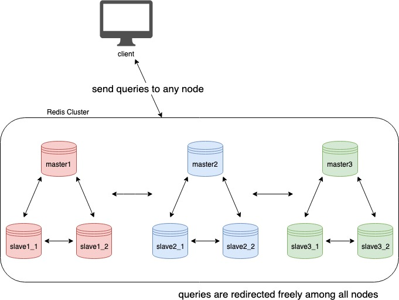
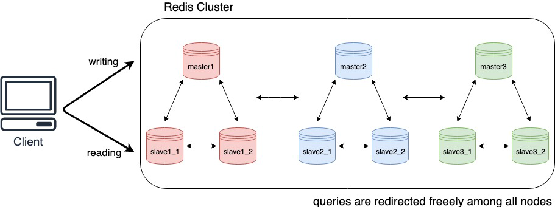

# Redis集群



## 通信

Redis集群要求任何一个Redis节点必须提供两个端口的连接，一个端口是用于客户端连接，另一个端口用于集群节点间同步，Redis对其定义为：`Cluster bus`。`Cluster bus`的目的是失败检测、配置更新以及主从间备份等等。

`cluster_bus_port = client_port + 10000`

## 数据分区

### hash slot
Redis集群中有**16384**个hash slots，每个集群节点**平均分摊hash slots**，比如有4个分区节点，则每个节点负责`16384 / 4 = 4096`个hash slots。根据平均分摊的方式，可以保证当集群节点增加或减少时，可以计算出所有hash slots变更后的目标节点，然后将数据平滑传输到新的节点。保证后续客户端可以正常与集群进行交互。

### Key的hash slot计算方式
- key中包含`{...}`，则计算时只计算`{}`中间的字符串内容
- 使用crc16进行计算并保证其值范围在0-16383(0x3FFF)
``` c
/* We have 16384 hash slots. The hash slot of a given key is obtained
 * as the least significant 14 bits of the crc16 of the key.
 *
 * However if the key contains the {...} pattern, only the part between
 * { and } is hashed. This may be useful in the future to force certain
 * keys to be in the same node (assuming no resharding is in progress). */
unsigned int keyHashSlot(char *key, int keylen) {**//keylen的计算使用sdslen函数计算**
    int s, e; /* start-end indexes of { and } */

    for (s = 0; s < keylen; s++)
        if (key[s] == '{') break;

    /* No '{' ? Hash the whole key. This is the base case. */
    if (s == keylen) return crc16(key,keylen) & 0x3FFF;

    /* '{' found? Check if we have the corresponding '}'. */
    for (e = s+1; e < keylen; e++)
        if (key[e] == '}') break;

    /* No '}' or nothing between {} ? Hash the whole key. */
    if (e == keylen || e == s+1) return crc16(key,keylen) & 0x3FFF;

    /* If we are here there is both a { and a } on its right. Hash
     * what is in the middle between { and }. */
    return crc16(key+s+1,e-s-1) & 0x3FFF;
}
```

### hash tag

hash tag支持在单条命令，事务、lua脚本等操作中包含的多个key可以从属于相同的hash slot。而这种保证就是通过hash tag的概念来实现的。hash tag即为{...}，详情参见上部分hash slot的计算方式

如果执行的命令、脚本、事务中包含多个不同的key，并且这些key的hash slot值不一致，则redis会拒绝执行目标命令并提示命令中包含了不同的hsah slot，所以，这种情况下，可以采取两种方案
- 拆解命令，单条执行，这样存在代码冗余，要多次和redis交互，但这种方案可以保证，redis的数据分布均匀
- 命令中关联的key，使用hash tag，但是这种做法会导致关联的key必须同时保存到某个相同的节点中，数据存储理论上不再是均匀分布。

## 主从模式
redis的各个数据分区节点为了保证高可用性，提供了主从模式。每个数据分区有一个主节点（负责不同的hash slots），同时也可以有多个从节点，其数据完全同步自相应的主节点，这样在主节点出故障时，Redis集群可以选择某一从节点替换，向客户端继续提供服务。

## 客户端交互



根据数据分区，我们可以知道不同的key可能是存储在不同的节点上，那么命令怎么到达目标节点?

redis不是采用直接在集群节点中转发命令到目标节点，而是当发现命令中指定的key不在当前节点，会返回给客户端目标节点的信息，再由客户端重新向目标节点发起命令。因此为了改善与redis集群交互的性能，通常客户端需要具备缓存redis集群节点的信息，以及他们负责的分区范围，在命令发送前，直接计算出目标节点。

同时主节点的压力，当执行命令带有 https://redis.io/commands/readonly command，可以直接在从节点获取数据。

## 一致性
- Redis集群的一致性非强一致性，即在某种条件下存在数据丢失的情况。
- Redis的主从备份与客户端消息处理之间是异步的，因此存在主节点数据不能及时同步到从节点
- 由于从节点在主节点出故障时，会被选举为主节点，此时如果从节点数据于原主节点不一致，则同样会造成一致性问题
- redis同样也是支持同步写（https://redis.io/commands/wait），但是仍不保证强一致性：复杂场景下，如果被选举出来的节点数据未完全同步，仍会导致数据丢失。

## 集群使用限制
- 因为一致性不是强一致性的，所以对于一致性要求比较高的需求，如充值、兑换等会则不能依赖与redis集群去实现，而对于数据要求不高的场景则可以使用：公告信息等
- 因为数据分区的设计，当我们在使用lua脚本的时候，跨多个key操作，一定要保证这多个key都存储在相同的节点上，可以考虑使用 `hash tag` 。因此在使用redis时，一定要做好key的设计。
- 因为redis集群对客户端有一定的要求：存储hash slot对应的redis集群节点的信息、读写分离等。因此，可以尽可能选择市场上比较成熟的库、框架或者使用云厂商提供的redis服务。
- redis集群节点间的不可用判断是根据 `node timeout` ，因此在使用时要尽可能确保该配置的值是合理的。
- 对于读命令可以尽可能选择在从节点中执行，减小主节点的压力。（读写分离），也可以对连接设置只读。

## 拓展

- 红锁（redlock）：redis方案下的分布式锁
- 集群下发布/订阅模式
- 哨兵模式

## 参考

- [Redis cluster tutorial - Redis](https://redis.io/docs/latest/operate/oss_and_stack/management/scaling/)
- [Redis Cluster Specification - Redis](https://redis.io/docs/latest/operate/oss_and_stack/reference/cluster-spec/)
- [Distributed locks with Redis - Redis](https://redis.io/docs/latest/develop/use/patterns/distributed-locks/)
- [Redis](https://redis.io/docs/latest/develop/connect/clients/)
