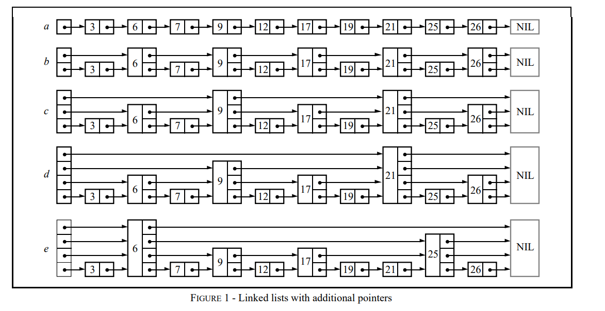
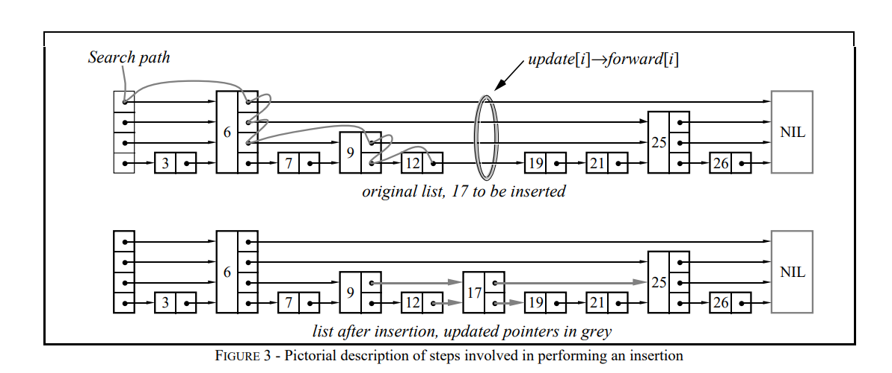

# skiplist算法以及在redis中的应用
skiplist即跳表，skiplist是一种数据结构，它的设计者是希望该数据结构作为平衡树的一种替代数据结构。同时针对平衡树的缺点，skiplist进行了优化改进。

## skiplist的改进
- skiplist的数据结构比较简单，本质上就是一个链表加上一些指针，不同与平衡树的数据结构。
- skiplist在内存开销上也是小于平衡树的。
- 在算法实现上相较于平衡树，skiplist算法比较好实现。

## 算法实现
skiplist的数据结构是通过有序链表+指针来实现的，其中对于链表的一个节点，会维护多个层级（level）的指针，各层级间相邻节点的差值比例不同，层级越大，关联节点越稀疏，层级1则覆盖了所有的节点（链表本身）。

搜索时，从最高层级开始查询，当遍历到的节点的key小于目标key，继续移动，如果遍历结束仍小于则该key在skiplist中不存在。当当前节点key大于目标key，则从下一个层级按照该流程进行查找，直至找到目标key或者该key不存在。




## redis的skiplist实现(zset)
```c
 /* Find the rank for an element by both score and key.
 * Returns 0 when the element cannot be found, rank otherwise.
 * Note that the rank is 1-based due to the span of zsl->header to the
 * first element. */
unsigned long zslGetRank(zskiplist *zsl, double score, sds ele) {
    zskiplistNode *x;
    unsigned long rank = 0;
    int i;

    x = zsl->header;//从skiplist的头节点开始
    for (i = zsl->level-1; i >= 0; i--) {//遍历各层级的节点
    //当在该层级进行遍历时，如果当前节点key小于搜索的key，则继续往前往前查找，
    //当当前key大于搜索的key，则结束当前层级的查询，跳到下一层级继续查找
        while (x->level[i].forward &&
            (x->level[i].forward->score < score ||
                (x->level[i].forward->score == score &&
                sdscmp(x->level[i].forward->ele,ele) <= 0))) {
            rank += x->level[i].span;
            x = x->level[i].forward;
        }

        /* x might be equal to zsl->header, so test if obj is non-NULL */
        if (x->ele && sdscmp(x->ele,ele) == 0) {
            return rank;
        }
    }
    return 0;
}
```

```c
/* Insert a new node in the skiplist. Assumes the element does not already
 * exist (up to the caller to enforce that). The skiplist takes ownership
 * of the passed SDS string 'ele'. */
zskiplistNode *zslInsert(zskiplist *zsl, double score, sds ele) {
    zskiplistNode *update[ZSKIPLIST_MAXLEVEL], *x;
    unsigned int rank[ZSKIPLIST_MAXLEVEL];
    int i, level;
    
    x = zsl->header;
    for (i = zsl->level-1; i >= 0; i--) {
        /* store rank that is crossed to reach the insert position */
        rank[i] = i == (zsl->level-1) ? 0 : rank[i+1];
        while (x->level[i].forward &&
                (x->level[i].forward->score < score ||
                    (x->level[i].forward->score == score &&
                    sdscmp(x->level[i].forward->ele,ele) < 0)))
        {
            rank[i] += x->level[i].span;
            x = x->level[i].forward;
        }
        update[i] = x;
    }
    /* we assume the element is not already inside, since we allow duplicated
     * scores, reinserting the same element should never happen since the
     * caller of zslInsert() should test in the hash table if the element is
     * already inside or not. */
    level = zslRandomLevel();
    if (level > zsl->level) {
        for (i = zsl->level; i < level; i++) {
            rank[i] = 0;
            update[i] = zsl->header;
            update[i]->level[i].span = zsl->length;
        }
        zsl->level = level;
    }
    x = zslCreateNode(level,score,ele);
    for (i = 0; i < level; i++) {
        x->level[i].forward = update[i]->level[i].forward;
        update[i]->level[i].forward = x;

        /* update span covered by update[i] as x is inserted here */
        x->level[i].span = update[i]->level[i].span - (rank[0] - rank[i]);
        update[i]->level[i].span = (rank[0] - rank[i]) + 1;
    }

    /* increment span for untouched levels */
    for (i = level; i < zsl->level; i++) {
        update[i]->level[i].span++;
    }

    x->backward = (update[0] == zsl->header) ? NULL : update[0];
    if (x->level[0].forward)
        x->level[0].forward->backward = x;
    else
        zsl->tail = x;
    zsl->length++;
    return x;
}
```

```c
/* Internal function used by zslDelete, zslDeleteRangeByScore and
 * zslDeleteRangeByRank. */
void zslDeleteNode(zskiplist *zsl, zskiplistNode *x, zskiplistNode **update) {
    int i;
    for (i = 0; i < zsl->level; i++) {
        if (update[i]->level[i].forward == x) {
            update[i]->level[i].span += x->level[i].span - 1;
            update[i]->level[i].forward = x->level[i].forward;
        } else {
            update[i]->level[i].span -= 1;
        }
    }
    if (x->level[0].forward) {
        x->level[0].forward->backward = x->backward;
    } else {
        zsl->tail = x->backward;
    }
    while(zsl->level > 1 && zsl->header->level[zsl->level-1].forward == NULL)
        zsl->level--;
    zsl->length--;
}
```
```c
/* Returns a random level for the new skiplist node we are going to create.
 * The return value of this function is between 1 and ZSKIPLIST_MAXLEVEL
 * (both inclusive), with a powerlaw-alike distribution where higher
 * levels are less likely to be returned. */
int zslRandomLevel(void) {
    int level = 1;
    while ((random()&0xFFFF) < (0.25* 0xFFFF))
        level += 1;
    return (level<32) ? level : 32;
}
```

## redis中的应用
在redis中跳表主要应用于zset（有序集合），zset适合游戏中排行榜功能的实现，它基于skiplist可以保证搜索、插入、删除的性能，同时在原有skiplist的基础上又进行了修改以适应redis的zset功能，比如实现双向链表，可以实现正向排序以及反向排序，同时zset允许key重复，可以保存相同key但不同值的数据。

在redis中，zset其实是由两种数据格式，一种是skiplist，另一种则是双向链表。当zset存储的数据大于一定长度后，将双向链表转换为skiplist。

## 参考
- [redis源码](https://github.com/redis/redis)
- [What is Skiplist & Why a Skiplist Index for MemSQL - SingleStore Blog - MemSQL is Now SingleStore](https://www.singlestore.com/blog/what-is-skiplist-why-skiplist-index-for-memsql/#:~:text=A%20skiplist%20is%20an%20ordered,redblack%20trees,%20or%20AVL%20trees.)
- [skiplists (cam.ac.uk)](https://www.cl.cam.ac.uk/teaching/2005/Algorithms/skiplists.pdf)
