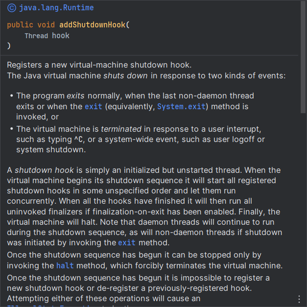
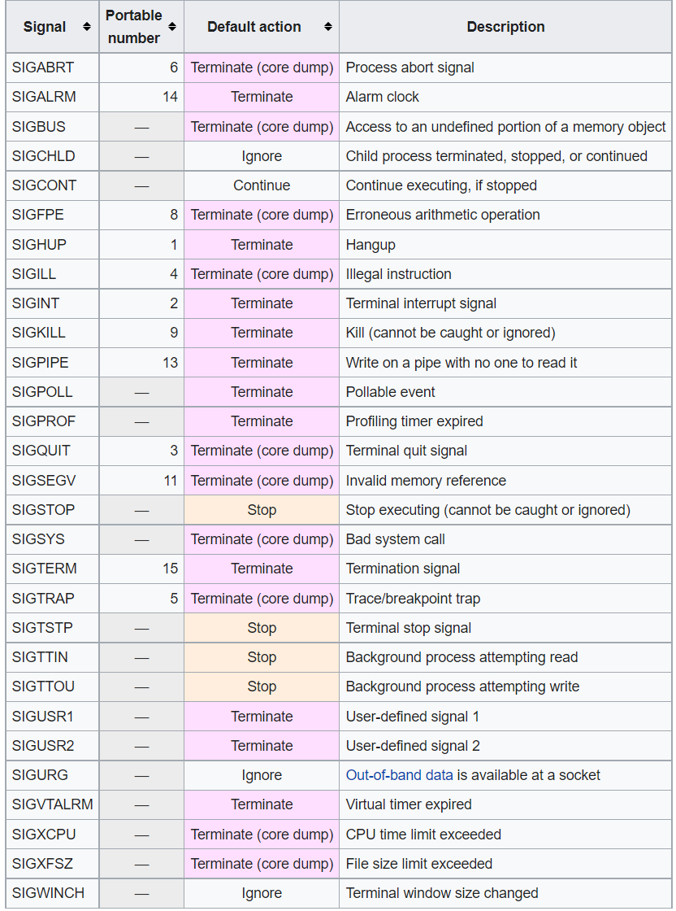

# 做一个优雅的进程杀手

问题来自于一个TCP服务器的开发过程，先简单介绍下该服务的流程：服务器在与客户端建立连接后，会将目标客户端的路由信息保存到 Redis 中，方便在集群环境下将消息分发到对应的服务器，完成消息发送。

因此，redis 中保存的路由信息非常重要，但是当服务进程关闭时，由于没有清理该服务关联的客户端路由，导致后续的消息在进行分发时出现了错误。

因此，该服务器需要增加进程关闭的处理机制，以便于当进程结束时，将当前进程关联的客户端的路由信息进行清除。这样的处理机制有多种实现方式。

## 系统层

在系统层面，操作系统为了我们提供了进程间通信机制（[IPC](https://en.wikipedia.org/wiki/Inter-process_communication)），其中在 Unix 以及 类Unix 的操作系统中，提供了一套信号（[Signal](https://en.wikipedia.org/wiki/Signal_(IPC))）机制，该机制允许向目标进程发送信号，当信号发送后，操作系统将中断目标进程的执行，并传递该信号给目标进程，如果目标进程有提供信号处理器（signal handler）则会执行该处理器，否则使用默认处理逻辑（测试下来是终止进程）。

### 信号发送
通过调用 `kill` 相关系统函数，可以发送信号到目标进程

```c
/* Send signal SIG to process number PID.  If PID is zero,
   send SIG to all processes in the current process's process group.
   If PID is < -1, send SIG to all processes in process group - PID.  */
extern int kill (__pid_t __pid, int __sig) __THROW;
```

### 信号处理

通过调用函数 `signal` 或 `sigaction`，注册处理器（函数指针）。这里需要注意的是有部分信号值是系统使用的（如 9：kill），不可以为这些信号值注册处理器。

```c
/* Type of a signal handler.  */
typedef void (*__sighandler_t) (int);


/* Set the handler for the signal SIG to HANDLER, returning the old
   handler, or SIG_ERR on error.
   By default `signal' has the BSD semantic.  */
extern __sighandler_t signal (int __sig, __sighandler_t __handler)
     __THROW;
     
/* Get and/or set the action for signal SIG.  */
extern int sigaction (int __sig, const struct sigaction * __act,
            struct sigaction * __oact) __THROW;
```

通过上述介绍可以看出来，需要调用系统函数去实现清理机制，这对于系统级编程语言（c/c++）很简单，但是对于其他的编程语言，则相对来说会比较麻烦。因此我们需要根据我们所使用的开发语言选择更加合适的方式。

## 应用层

Java中提供了一套 hook 机制，可以注册一个 hook 线程，当 jvm 关闭时，jvm 会执行所有注册的 hook 线程。



因此，我们仍然可以通过该 api 将清理路由的逻辑放到 hook 线程中去执行。但是该方案有两个问题。
- 正如 java doc 中所说明的那样，通过 kill -9 等方式强制关闭进程时，jvm 无法执行 hook 线程。
- jvm 允许注册多个 hook 线程，但是这些 hook 线程的执行顺序是不固定的，我们的应用有很多的组件，有自己的 hook 线程，而这些组件的 hook 线程一般是用于清理组件持有的资源，而我们的清理路由的 hook 线程会依赖这些组件。一旦组件的 hook 线程先执行，清理路由线程在执行时，会因为缺少依赖的组件而导致清理失败。

由于这两个原因，通过 java 的 hook 机制，仍然实现不了我们的清理机制，因此我们需要再考虑别的方案。

## 业务层
通过上面介绍的信号通信机制，我们可以通过在业务层实现自定义的信号机制，如服务内部启用轻量级的 http/tcp 服务，需要关闭进程时，运维发送请求到目标服务，通知服务，当前进程需要关闭。

推送服务通过实现一个轻量级的 http 服务，再结合容器的编排，每当需要重启时，会先发送服务终止的 http 请求，推送服务执行路由清除任务，随后运维侧执行 kill -9 命令。

业务层的实现可以保证程序执行清除任务的时候所有组件都是正常可用的，并且可以按照服务架构自由的设计各组件的终止顺序。但是业务层实现通信机制仍然存在一定的问题，即该逻辑正常执行的前提在于程序是由运维侧正常重启，如果是因为程序本身的崩溃，如 oom ，则该逻辑仍无法保证可以正常执行。

## 拓展

常见的信号值



## 参考

- https://en.wikipedia.org/wiki/Signal_(IPC)
- https://man7.org/linux/man-pages/man1/kill.1.html
- https://man7.org/linux/man-pages/man2/signal.2.html