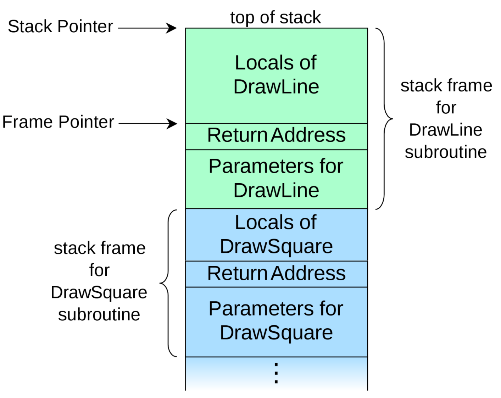
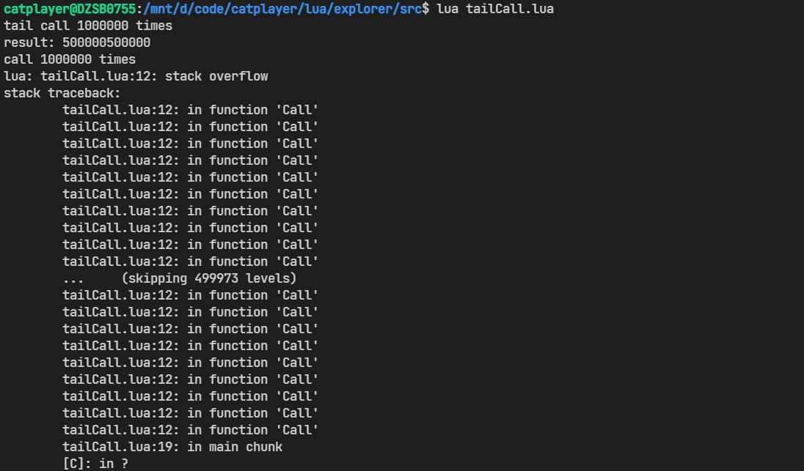
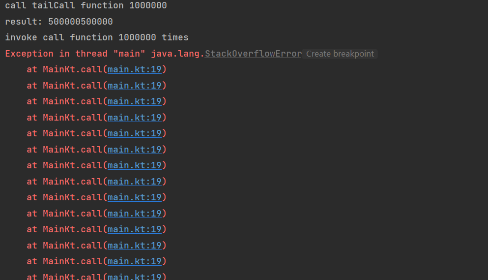
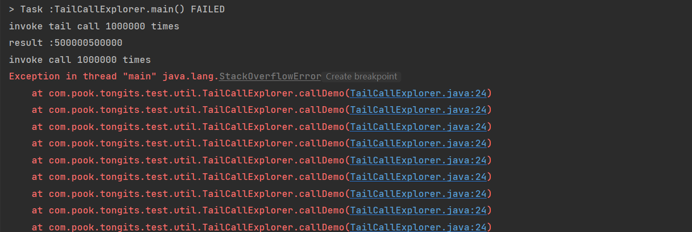

# 尾递归优化

## 递归

在软件开发中递归是一种常用的编程模型，递归简单的总结就是函数自己调用自己，使用递归可以使我们的代码更加简洁，逻辑更加清晰，但是同时递归存在着一些缺点。

首先我们看下递归的底层实现细节。

递归的实现不得不提到函数的调用栈，当函数调用时，计算机需要记录函数调用的地址，方便函数执行结束后可以回到原先执行的位置，因此，大多数的编程语言的内部实现通过调用栈来保存函数的调用地址。



因此在递归的过程中，随着递归的层级加深，保存到调用栈的栈帧就会越来越多，一旦达到调用栈的内存上限，就会导致内存溢出。所以有经验的程序员对于递归的使用都需要非常谨慎。

## 尾递归
在函数中，最终return的语句中，只调用单个函数的情况叫做尾调用。

```java
//尾调用
int foo(data) {
    a(data);
    return b(data);
}

//尾调用
int bar(data) {
    if ( a(data) ) {
        return b(data);
    }
    return c(data);
}

//非尾调用
int foo2(data) {
    int ret = a(data);
    return ret;
}
```

而在尾调用中，最终调用的函数是自身的函数叫做尾递归函数。尾递归函数本身符合递归的定义：自己调用自己。

```java
//非尾递归写法
int recursionFactorial(int number) {
    if (number == 1)
        return 1;

    return number * recursionFactorial(number - 1);
}

//尾递归写法
int tailCallFactorial(int number, int result) {
    if (number == 0)
        return result;

    return tailCallFactorial(number - 1, number * result);
}
```

而尾调用优化则是根据尾调用的特点：**被调用函数执行后的结果即为目标函数的执行结果**，调用函数的栈帧信息并不重要，所以每次进行尾调用时，不会为**被调用函数**生成新的栈帧压入调用栈，而是把**调用函数的栈帧信息替换为被调用函数的栈帧**（类似于 `goto` 的作用）。因此当函数是尾递归函数时，并不会根据递归的层级生成相应数量的栈帧，而是每次都只更新栈帧，这样就可以节省内存，最重要的是可以避免调用栈溢出。

## 实现

### Lua
不同其他语言将尾调用作为可选优化，lua中只要符合尾调用语法的函数就会自动优化。这是由于Lua作为一种内嵌语言，必须要保证运行时的开销足够小。

#### 摘录自Lua虚拟机源码：
``` c
static void retstat (LexState *ls) {
  /* stat -> RETURN [explist] [';'] */
  FuncState *fs = ls->fs;
  expdesc e;
  int nret;  /* number of values being returned */
  int first = luaY_nvarstack(fs);  /* first slot to be returned */
  if (block_follow(ls, 1) || ls->t.token == ';')
    nret = 0;  /* return no values */
  else {
    nret = explist(ls, &e);  /* optional return values */
    if (hasmultret(e.k)) {
      luaK_setmultret(fs, &e);
      //返回语句是函数调用，并且只有一个返回值，即保证是尾调用
      //设置执行指令为尾调用：OP_TAILCALL
      if (e.k == VCALL && nret == 1 && !fs->bl->insidetbc) {  /* tail call? */
        SET_OPCODE(getinstruction(fs,&e), OP_TAILCALL);
        lua_assert(GETARG_A(getinstruction(fs,&e)) == luaY_nvarstack(fs));
      }
      nret = LUA_MULTRET;  /* return all values */
    }
    else {
      if (nret == 1)  /* only one single value? */
        first = luaK_exp2anyreg(fs, &e);  /* can use original slot */
      else {  /* values must go to the top of the stack */
        luaK_exp2nextreg(fs, &e);
        lua_assert(nret == fs->freereg - first);
      }
    }
  }
  luaK_ret(fs, first, nret);
  testnext(ls, ';');  /* skip optional semicolon */
}
```

```c
/*
** Prepare a function for a tail call, building its call info on top
** of the current call info. 'narg1' is the number of arguments plus 1
** (so that it includes the function itself).
*/
void luaD_pretailcall (lua_State *L, CallInfo *ci, StkId func, int narg1) {
  Proto *p = clLvalue(s2v(func))->p;
  int fsize = p->maxstacksize;  /* frame size */
  int nfixparams = p->numparams;
  int i;
  for (i = 0; i < narg1; i++)  /* move down function and arguments */
    setobjs2s(L, ci->func + i, func + i);
  checkstackGC(L, fsize);
  func = ci->func;  /* moved-down function */
  for (; narg1 <= nfixparams; narg1++)
    setnilvalue(s2v(func + narg1));  /* complete missing arguments */
  ci->top = func + 1 + fsize;  /* top for new function */
  lua_assert(ci->top <= L->stack_last);
  ci->u.l.savedpc = p->code;  /* starting point */
  ci->callstatus |= CIST_TAIL;
  L->top = func + narg1;  /* set top */
}
```

#### demo
``` lua
-- 常规递归
function Call(value)
    if value == 1 then
        return value
    end
    return value + Call(value - 1)
end
```

``` lua
-- 尾调用递归
function TailCall(value, result)
    if value == 1 then
        return result
    end
    return TailCall(value - 1, value + result)
end
```


### Scala

Scala通过注解 `@tailrec` 声明目标函数是尾递归函数，Scala在编译时会在目标函数的起始位置加上 `label`，每次执行到尾调用时，强制执行语句跳转到 `label` 处，并更新函数的参数值，因此每次递归不会生成新的栈帧。

```scala
def recursionFactorial(number: Int): Int =
  if (number == 0) 1 else number * recursionFactorial(number - 1)
```

```scala
@tailrec
final def tailRecursionFactorial(number: Int, result: Int): Int =
  if (number == 0) result else tailRecursionFactorial(number - 1, number * result)
```

### Kotlin

在Kotlin中通过关键字 `tailrec` 声明目标函数是尾递归函数，Kotlin在编译时会将该函数的实现优化成for循环。避免可能造成的调用栈溢出问题。

```kotlin
//常规写法
fun call(number: Long): Long {
    if (number == 1L)
        return number
    return number + call(number - 1)
}
```

```kotlin
//尾递归
tailrec` fun tailCall(number: Long, result: Long): Long {
    if (number == 0L)
        return result
    return tailCall(number - 1, number + result)
}
```



### Java

Java在编译器层面上并不支持尾调用优化，因此在代码中直接按照尾调用的语法编写尾递归方法和常规的递归没有任何区别，但是可以基于Java 8引入的 lambda 表达式变相实现尾调用优化。
```java
public class TailCallExplorer {

    public static void main(String[] args) {

        long times = 1_000_000;
        
        System.out.println("invoke tail call " + times + " times");
        System.out.println("result :" + tailCallDemo(times));
        System.out.println("invoke call " + times + " times");
        System.out.println("result: " + callDemo(times));
    }

    public static Long callDemo(long number) {
        if (number == 1)
            return number;
        return number + callDemo(number - 1);
    }

    public static Long tailCallDemo(long number) {
        return tailCallDemo0(number, 0).invoke();
    }

    public static TailCall<Long> tailCallDemo0(long number, long result) {
        if (number == 0L)
            return done(result);
        return call(() -> tailCallDemo0(number - 1, number + result));
    }

    @FunctionalInterface
    interface TailCall<T> {

        TailCall<T> apply();

        default boolean isCompleted() {
            return false;
        }

        default T result() {
            throw new UnsupportedOperationException();
        }

        default T invoke() {
            //虽然逻辑上是递归调用，但实际上只调用了invoke方法，所以栈帧不会增加
            return Stream.iterate(this, TailCall::apply)
                    .filter(TailCall::isCompleted)
                    .findFirst()
                    .get()
                    .result();
        }
    }

    public static <T> TailCall<T> done(T result) {
        return new TailCall<T>() {
            @Override
            public TailCall<T> apply() {
                throw new UnsupportedOperationException();
            }

            @Override
            public boolean isCompleted() {
                return true;
            }

            @Override
            public T result() {
                return result;
            }
        };
    }

    public static <T> TailCall<T> call(TailCall<T> nextCall) {
        return nextCall;
    }
}
```



## 参考
- [Tail call - Wikipedia](https://en.wikipedia.org/wiki/Tail_call)
- [Call stack - Wikipedia](https://en.wikipedia.org/wiki/Call_stack)
- [Return statement - Wikipedia](https://en.wikipedia.org/wiki/Return_statement)
- [scala/TailCalls.scala at 2.13.x · scala/scala (github.com)](https://github.com/scala/scala/blob/2.13.x/src/compiler/scala/tools/nsc/transform/TailCalls.scala)
- [trampolines.pdf (higher-order.com)](https://blog.higher-order.com/assets/trampolines.pdf)
- [Lua 5.3 Reference Manual](https://www.lua.org/manual/5.3/manual.html#3.4.10)
- [https://kotlinlang.org/docs/functions.html#tail-recursive-functions](https://kotlinlang.org/docs/functions.html#tail-recursive-functions)
- [Tail Recursion in JAVA 8 - Knoldus Blogs](https://blog.knoldus.com/tail-recursion-in-java-8/)
