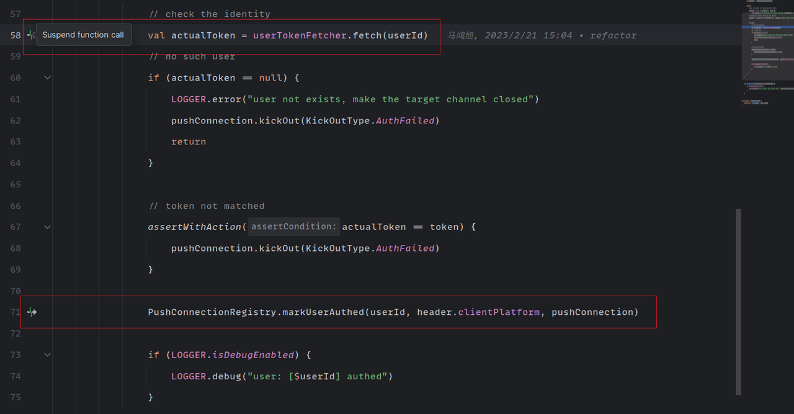
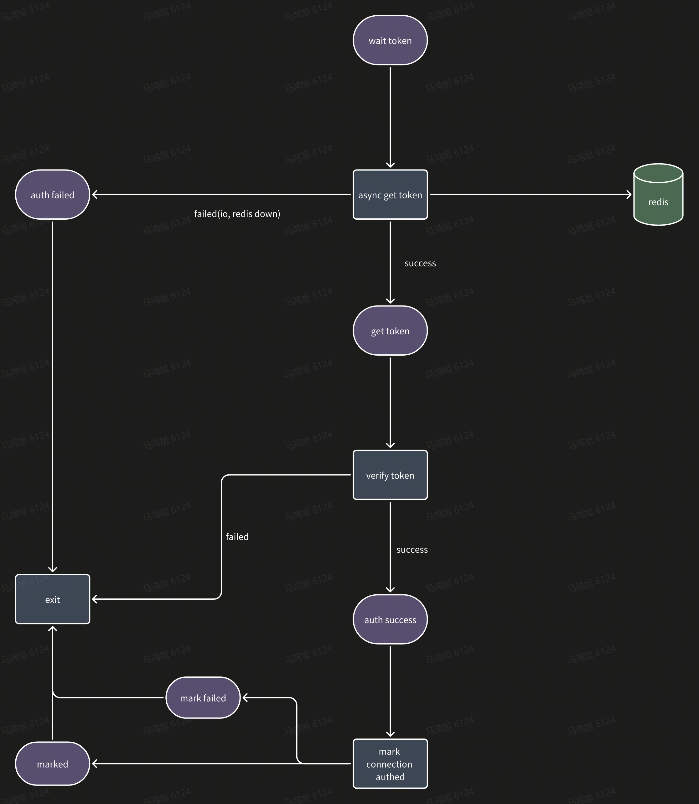

# 无栈协程的实现

最近在海外项目中引入了 Kotlin ，实现了 Java 和 Kotlin 的混合编译，因此可以使用 Kotlin 一些好用的特性，提高开发效率，其中我最喜欢的特性就是协程，它可以帮助我们按照顺序执行的习惯来完成异步执行的操作。

下面我们看一个例子。

```kotlin
// check the identity
val actualToken = userTokenFetcher.fetch(userId)
// no such user
if (actualToken == null) {
    LOGGER.error("user not exists, make the target channel closed")
    pushConnection.kickOut(KickOutType.AuthFailed)
    return
}

// token not matched
assertWithAction(actualToken == token) {
    pushConnection.kickOut(KickOutType.AuthFailed)
}

// mark connection is authed
PushConnectionRegistry.markUserAuthed(userId, header.clientPlatform, pushConnection)

if (LOGGER.isDebugEnabled) {
    LOGGER.debug("user: [$userId] authed")
}
```

代码逻辑很简单，获取 token ，验证客户端传入的 token ，最终将连接标记为已认证。代码看上去是同步执行的，但其实这里发生了两次异步操作

1. 获取 token 
2. 标记连接已认证。

如果我们在 idea 中打开这段代码，我们会看到 idea 其实已经提示我们该函数中存在了挂起 (suspend) 操作。



如果我们不使用协程，那么实现这样的功能应该怎么做呢？如果大家有早期 JavaScript 的编程经验的(现代 JavaScript 有 async 和 await 关键字)，应该就知道了：回调 (callback) 。

```kotlin
   userTokenFetcher.fetchCallback(
    userId, 
    { actualToken->
        // no such user
        if (actualToken == null) {
            LOGGER.error("user not exists, make the target channel closed")
            pushConnection.kickOut(KickOutType.AuthFailed)
            return
        }

        // token not matched
        assertWithAction(actualToken == token) {
            pushConnection.kickOut(KickOutType.AuthFailed)
        }

        PushConnectionRegistry.markUserAuthedCallback(
            userId, 
            header.clientPlatform, 
            pushConnection,
            {
                if (LOGGER.isDebugEnabled) {
                    LOGGER.debug("user: [$userId] authed")
                }
            }
        )
    }
)
```

这里我们看到了，所有依赖异步操作结果的执行逻辑，必须将其包裹为回调函数，这样如果使用的异步操作过多，过于复杂，就会遭遇到著名的回调地狱 (callback hell) 。这样后期的代码维护无疑是非常痛苦的。而 Kotlin 的协程式异步编程则显得更加的简单易懂。

那么 Kotlin 是怎么实现这种以同步代码的方式编写异步逻辑的协程的呢？

## 状态机

在讲 kotlin 的底层实现之前我们先聊聊状态机的概念，什么是状态机呢？简单的来说就是一个对象在不同的状态下会做出不同的行为。同时在行为的作用下，对象会从一个状态转换为另一个状态，并执行新状态的行为，直至所有的行为执行完毕（有限状态机）。

如果我们把刚刚的逻辑转换为一个状态机：



## Kotlin SuspendLambda/SuspendFunction 

在 Kotlin 中所有的协程执行函数 (lambda/function) , 会在编译时期转换为相应类的对象，而这些对象就是一个状态机，每个挂起点 (suspend point) 就是一种状态，当相应的协程执行完成，相应挂起点的后续逻辑就会执行下去，直至遇到下个挂起点，等待挂起协程的执行，直至整个函数执行完成。

```kotlin
class <anonymous_for_state_machine> extends SuspendLambda<...> {
    // The current state of the state machine
    int label = 0
    
    // local variables of the coroutine
    int x
    
    void resumeWith(Object result) {
        if (label == 0) goto L0
        if (label == 1) goto L1
        else throw IllegalStateException()
        
      L0:
        x = 0
      LOOP:
        if (x >= 10) goto END
        label = 1
        result = nextNumber().await(this) // 'this' is passed as a continuation 
        if (result == COROUTINE_SUSPENDED) return // return if await had suspended execution
      L1:
        // external code has resumed this coroutine passing the result of .await()
        x += ((Integer) result).intValue()
        label = -1
        goto LOOP
      END:
        label = -1 // No more steps are allowed
        return 
    }          
}
```

## cps: Continuation passing style

那么 Kotlin 是怎么知道哪些函数是协程呢？ Kotlin 通过关键字 `suspend` 来识别目标函数、lambda 是否是协程。

```kotlin
suspend fun authClient(...)//suspend function
suspend ()->Unit //suspend lambda
```

每一个挂起函数实际上在运行时都有一个额外传入的参数：`Continuation` 当对应的协程执行完成，会调用 `Continuation` 的 `resumeWith(result: Result<T>)` 方法，resumeWith 方法会执行后续的逻辑，并将挂起函数的结果带入到执行逻辑中。这种方法被称为`cps: Continuation passing style。`

这样整个转换的过程是在编译期完成的，源码层面开发者是没有感知的。简单理解的话，`Continuation.resumeWith(result: Result<T>)`就是异步操作的回调函数，只不过该逻辑是编译器帮我们实现的。这样既实现了异步操作，也保证了代码的简洁性。

Kotlin 这种通过关键字实现 cps 的方式实际上是借鉴了 c# 的异步实现 (async,await) 。但同时 Kotlin 又进行了简化，c# 中通过多个关键字来实现不同场景的协程（异步，阻塞等等），而 Kotlin 中则都是通过提供库 API 的形式来实现的，更加的简单和灵活（起码咱们可以少背那么多的关键字，只要记住 `suspend` ）。

## 协程的调度

我们目前知道了 Kotlin 通过 cps 的方式实现了协程，而这些协程绝大多数都是异步执行的，那么异步执行的协程是怎么执行的？或者说这些协程是在哪些线程中执行的？我们都知道我们任何一个代码块都是需要在操作系统分配的线程中执行，即使我们运行的 main 方法也是执行在当前进程的主线程 (main thread) 中。

如果大家有了解过 go 语言，就可以知道，go 的协程的调度是 go 运行时提供的。其底层实现则是通过一组线程去调度所有的协程。而Kotlin的协程调度则更加灵活，对于 gui 的项目可以绑定 ui 线程，将所有用于渲染 ui 的协程都调度到 ui 线程中；IO 型的任务，则有相应的 IO 调度器进行调度；也可以直接使用 Java 的线程池来调度协程等等，这些都是通过提供类库来完成，同时提供了`ContinuationInterceptor`接口，可以自定义调度机制，这样你可以实现任何符合你业务场景的协程调度机制。

## 无栈协程

其实通过上面的讲解，大家对 Kotlin 的协程实现有了初步的了解之后应该就能明白，通过状态机的实现，本质上就是执行回调，并没有自己的调用栈，因此 cps + 状态机就是无栈协程的一种实现方式。

## 参考

- https://refactoring.guru/design-patterns/state
- https://github.com/Kotlin/KEEP/blob/master/proposals/coroutines.md
- https://en.wikipedia.org/wiki/Continuation-passing_style#:~:text=In%20functional%20programming%2C%20continuation%2Dpassing,the%20usual%20style%20of%20programming.