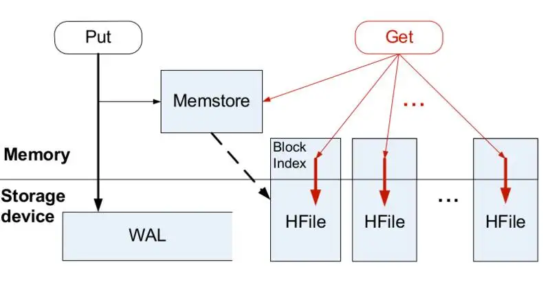
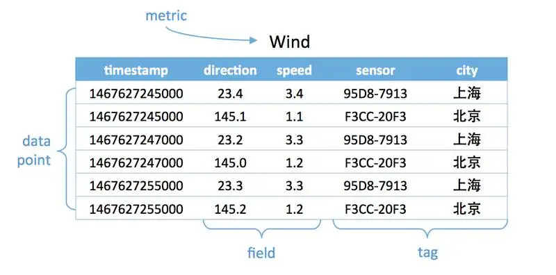

# 时序数据库的存储方案

我们业务中常见的数据库类型主要有两种：关系型数据库以及kv数据库。前者则是指的传统意义上的数据库，如 oracle、mysql。 kv数据库则是用于逻辑简单的缓存数据库。如 redis、mongo db。目前数据库领域又出现了一种新型的数据库类型：时序数据库。

## 什么是时序数据库

时序数据是基于时间的一系列的数据。在有时间的坐标中将这些数据点连成线，往过去看可以做成多纬度报表，揭示其趋势性、规律性、异常性；往未来看可以做大数据分析，机器学习，实现预测和预警。

对比传统数据库仅仅记录了数据的当前值，时序数据库则记录了所有的历史数据。同时时序数据的查询也总是会带上时间作为过滤条件。

看到这里大家可能觉得时序数据库不就是日志表吗？事件发生或数据变更时将当前值和发生的时间记录到日志表的一行里。在小规模的数据量下，确实日志表的作用和时序数据库的作用是可以等同。但是这往往也引出了时序数据库最核心的优点：支持快速存储以及查询海量数据。

既然其优点是支持海量数据，那么怎么存储数据就是非常核心的一环了。

## 时序数据库的存储

传统的数据库存储一般都是采用 `B tree` 进行存储的。虽然该数据结构可以减少插入和查询时在磁盘的寻道次数。但是本质上寻道的操作就是一个非常耗时的操作：一般在 10ms 左右。当面对海量数据存储时，用于需要进行大量的寻道操作，因此使用 `B tree` 进行存储，会导致存储很慢。

而时序数据库的应用场景就是频繁存储数据，因此如果使用传统数据库的方案则会导致非常的慢。因此时序数据库通常采取 `LSM tree`

### LSM tree

这里我们简单介绍一下双层`LSM tree (two-level LSM tree)`。该数据结构由两部分的树型数据结构构成，这里我们简称为a和b

- a：该层空间比较小，存储在主存中。
- b：该层空间则相比更大，存储在磁盘中。

插入数据时，先直接插入a层，当a层存储的数据量达到一个阈值，则需要将部分连续的a层的数据顺序存储到b层中。整个流程中，首先插入是直接存储在主存里，然后再以异步的方式将数据顺序写入到磁盘里。同时b层中的数据也会定期进行整理，排序。因此整个流程相较于不停在磁盘寻道的 `b tree` ，该方案下实际写入磁盘则是异步顺序写入，这样自然保证了写入时的速度。

### 存储分片

上面我们介绍了 `LSM tree` 的存储方案，但是实际场景中，海量的数据依赖单台机器支撑可能是远远不够的。因此一般真实的时序数据库都是分布式存储，而分布式存储有个核心的问题需要去解决：分片（sharding）问题。之前介绍redis的集群时，我们说到过redis hash slot的概念，redis就是采用了哈希分片的方案。那么时序数据库又是使用什么分片方案呢？

这里我们简单介绍几种常见的分片方法。
- **哈希分片**：这种方法实现简单，均衡性较好，但是集群不易扩展：redis拓展/减少集群节点时，需要各个节点对保存的key根据新的hash slot范围进行迁移，会影响redis对外提供服务。
- **一致性哈希**：这种方案均衡性好，集群扩展容易，只是实现复杂。代表有 Amazon 的 DynamoDB 和开源的 Cassandra。
- **范围划分**：通常配合全局有序，复杂度在于合并和分裂。代表有 Hbase。

介绍时序数据库的分片设计之前我们先简单的介绍几个时序数据库的概念。
- metric: 度量，相当于关系型数据库中的 table。
- data point: 数据点，相当于关系型数据库中的 row。
- timestamp：时间戳，代表数据点产生的时间。
- field: 度量下的不同字段。比如位置这个度量具有经度和纬度两个 field。一般情况下存放的是会随着时间戳的变化而变化的数据。
- tag: 标签，或者附加信息。一般存放的是并不随着时间戳变化的属性信息。timestamp 加上所有的 tags 可以认为是 table 的 primary key。

一般时序数据库是用于查询一段时间内某个维度的趋势，因此通常是根据`mrtric + tag + timestamp`来进行分片，这样就可以把相同纬度的某个时间范围内的数据分到相同的机器上进行存储。这样查询数据的时候就可以在一台机器上按照时间顺序读取到目标数据，因为可以做到非常快速的查询。

同时，当我们查询更大时间范围的数据时，我们可以根据需要查询的时间范围，定位到一个或多个存储的机器，可以做到去几个机器进行同时查询，做到大的时间范围查询可以和小的时间范围差不多的查询速度。其实我们在使用关系型数据库时，有类似的做法：分区表按照时间分区，查询时带上时间查询条件，数据库会帮我们去指定的分区表中查找数据。

## 参考
- https://en.wikipedia.org/wiki/Time_series_database
- https://en.wikipedia.org/wiki/B-tree
- https://www.influxdata.com/time-series-database/
- https://juejin.cn/post/6844903750860013576